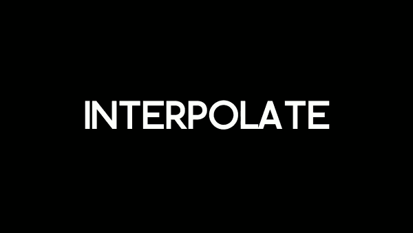

# RifeAUTO
Automate RIFE

### How to
Change your video file name to 'mov.mp4' and copy it to the main directory.

Run RifeAuto.

### Sample

### Interpolate Performance
@ GTX1070, RX580

720x480 (DVD)    50fps

1280x720 (HD)   25fps

1920x1080 (FHD)  12fps

2560x1440 (QHD)  6fps

3840x2160 (4K) 3fps

### Links
Core binary is from:

https://github.com/nihui/rife-ncnn-vulkan/

Author WebSite:

http://kxvr.kr/
